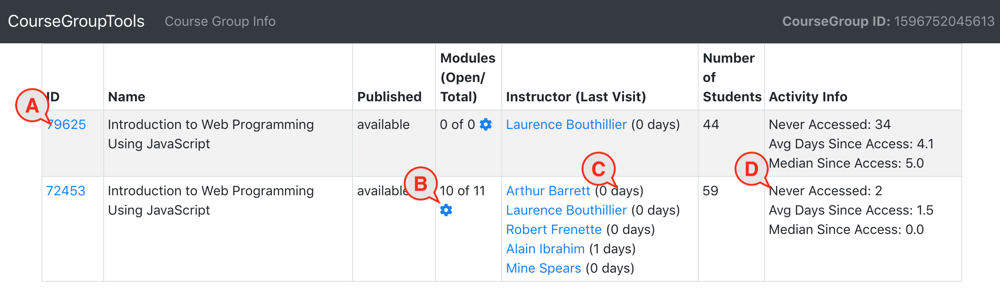

# coursetools

This is a proof-of-concept project exploring some tools for monitoring, managing, and updating Canvas courses using the Canvas API.

## Installing and Running Coursetools
Coursetools can be installed on any computer that has NodeJS installed. The Github project includes both the server- and client-side source code, as well as a prebuilt React runtime which can be served from the NodeJS/Express server.

+ Begin by installing NodeJS for your platform from https://nodejs.org/en/
If you don't have git installed, install it for your platform from https://git-scm.com/download/  
+ Open a command-line and retrieve the Coursetools code from github by typing
git clone https://github.com/Harvard-DCE-CSCIE3/coursetools.git
+ Once downloaded, navigate to the project folder and install the dependencies by typing
`npm install`  When finished, the application should be ready to run locally.
+ Type npm start to launch Coursetools. You can access the program at https://localhost You may see a warning that the SSL certificate is unverified - this is correct as it's a locally-generated key for development purposes. It poses no risk and you can safely proceed to the application. All communication between the application and Canvas are SSL-encrypted. The prebuilt client application is served on a static route by the NodeJS/Express server at  https://localhost/coursetools

## Running in Development Mode
If you wish to work with the application's React source code, you must do the above steps, and the following:
+ From the command-line in a new window (so that you are leaving the process started in the above steps running), navigate to the React project directory at `/client/coursetools`
+ Install the React dependencies by typing npm install
+ Start the React development server from here by typing `npm start`
+ Rather than accessing the client application from the link on the Logged In page, you'll use http://localhost:3000 This loads the React application from the source code rather than the prebuilt static files. Updates to the React source code will be reflected immediately in the application.

If you npm run build, the application will be built with production settings and paths and saved to the path which is served by the `/coursetools` static path configured in Express.

## Feature Set and Implementation
Coursetools consists of one server-side Web page and a client-side React application. The server-side page prompts the user for the canvas hostname, which is institution specific, and their Access Token.

Once authorized by Canvas, the Coursetools retrieves the user's profile and the screen updates to greet the user by name and provide a link to the Coursetools client application and a link to log out of the program. Logging out destroys the server-side session and removes the hostname and token from session memory.

The Go To Coursetools link opens the application in a new browser tab so as to leave the logout link available at all times.

## Course Search
The main Coursetools page presents a Course Search screen. The screen offers search criteria including a drop-down of Accounts the user has administrative access to, a drop-down of Terms, and a text entry field for searching within course names. If all are left blank, the search will return all courses the user has permission to see. In some cases, this could include hundreds or thousands of courses and the query may take a long time to complete.

Upon completion of the search, the screen populates with course information including course ID and title, term, subaccount, published status, number of enrolled students, and the course open date. Each column can be filtered and sorted.

Actions available for each course include:
> A: Clicking on the course ID number opens the course itself in Canvas in a new browser tab. The user's usual Canvas authentication method will apply.
>
> B: Clicking on the gear icon will open the Course Info screen for the course in a new browser tab.
>
> C: Clicking on the checkbox will add this course to a selection of multiple courses - referred to here as a Course Group. Once a course is selected, an Open Course Group button appears for displaying more detailed information about the selected courses. The Course Group page runs more detailed and sometimes  time-consuming queries against the set of selected courses.

## Course Info
The Course Info screen consists of three views:
+ Course Info
+ Course Modules
+ Course Assignments

Course Info contains basic configuration data for the course.

## Course Modules

Course Modules provides an interactive view into the course content, and permits editing and updating of content and configuration associated with Modules and Module Items.

Functionality is as follows (referring to the figure above):

>A: Clicking the link-out icon will open this module item in Canvas in a new browser tab.
>
>B: Clicking the eyeball icon will open a preview of the module item content in a popup window on this screen. Clicking elsewhere on the page will close the popup. This is very useful for quickly browsing a course's content.
>
>C: The Module or Module Item name is displayed, and can be edited by double-clicking on it. Once this field has been changed by the user, the field is highlighted with a red box to show that there are unsaved changes, and a Save Changes button [G] appears.
>
>D: Shows whether the module or module item is published. Clicking the cycle icon will toggle the published state. Unsaved changes appear highlighted by a red box.
>
>E: Convenience buttons are provided for bulk actions that may be done during course setup. Buttons are provided that will unpublish all modules and module items, publish all, or clear all open and due dates that appear on the page.  Unsaved changes are highlighted with a red box.
>
>F: Some items have open dates or due dates, in which case they are displayed here. These values can be edited/copied/pasted as text or selected using a date/time selector. The time selection has 23:59 included as an option, since due dates are often set as "the end of the day". Time zones are determined according to the local system time on the client, so if the local time is different from the institution's time, the user must take this into account when setting this value.
>
>G: This button appears when any data on the page has been edited, and floats above the table at the top right corner of the window. Clicking it will send updates of all highlighted items to Canvas via the Canvas API, and a confirmation of how many records were successfully updated will appear.

## Course Assignments
The Course Assignments view and functionality is identical to the Course Modules screen, except that it queries for all graded course activities, including Canvas Assignments, Quizzes, and Discussion Topics.

Depending on the way the course is organized in Canvas, this may include items that appear in the Course Modules view as well. While Course Modules will display anything which appears as a distinct Module Item in Canvas, Course Assignments will display all graded activities whether or not they appear as Module Items.

## Course Groups
Coursetools allows users to select a group of courses from the Course Search results upon which to create more detailed reports.

The user may select courses on the Course Search page by clicking the checkboxes next to each course. A user can also select a range by selecting a course and then shift-clicking a course elsewhere in the list.

Once courses are selected, an Open Course Group button appears in the page header. Clicking this opens the Course Group screen in a new browser tab.

Functionality is as follows:
>A: Clicking the course ID number will open the course in Canvas in a new browser tab.
>
>B: The Modules column shows the number of modules that are open out of the total number of modules. A course with no modules, or one in which all modules are closed may indicate that the course has not yet been set up.Clicking the gear icon in the Modules column opens the Course Modules page (described above) in a new browser tab.
>
>C: A list of users with Instructor roles is shown, along with the number of days since each instructor's last login to the course. This can be misleading, since institutions sometimes enroll non-instructors, such as instructional designers or media support staff, with instructor roles. >
>D: An instructor who has not visited a course may be in need of technical support or other assistance.
Student participation data here includes the number of students who have not visited the course at all. For those who have visited, the mean and median days since last access are reported.

Days-since-access is only valuable when offered in comparison to the other students in a course. Because course designs vary and activities and expectations can be unique to each course, there's no absolute level of participation with the Canvas course that indicates good performance.

This is perhaps the area of the application where the most value can be added with future development. A visual representation of student engagement within and across courses may provide a way to easily spot outliers. Other metrics for student activity may be useful as well, such as page views, participations (defined as a student submitting something to the course), or number of late submissions.  
